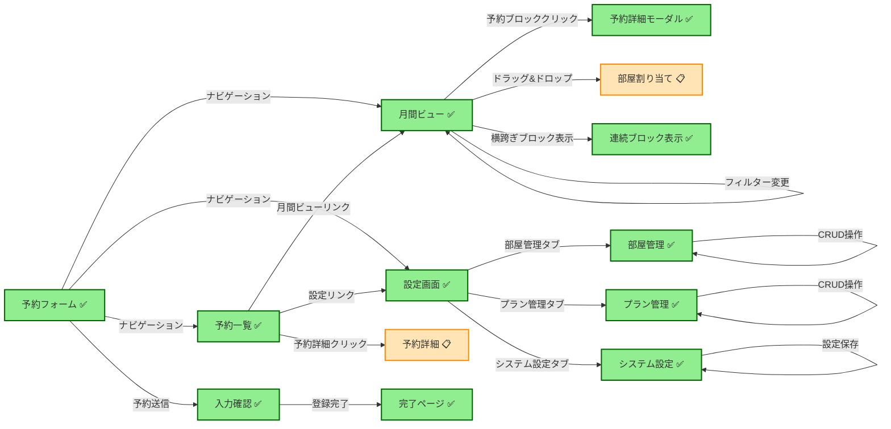
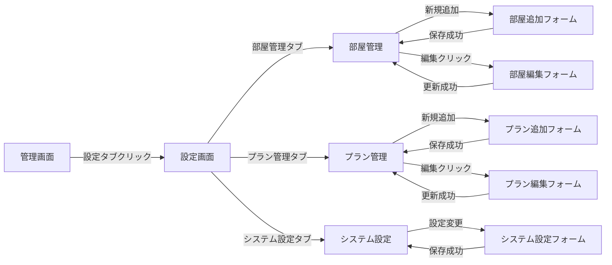

## 1. 要件定義

### 1.1 目的と概要

* **目的**: 宿泊業向け予約管理システムを自社開発し、フロント業務効率化と顧客向けオンライン予約を両立する。
* **対象ユーザー**:

  * フロントスタッフ（管理画面利用）
  * 顧客（Web予約フォーム利用）
* **基本機能**:

  1. 月間ビュー（部屋別1ヶ月予約状況の俯瞰・割当）
  2. 日間ビュー（当日部屋配置・稼働状況確認・変更）
  3. 予約検索（条件指定検索・CSV出力）
  4. 予約追加（管理者・顧客双方向フォーム）
  5. 台帳管理（予約者情報・部屋割・会計）
  6. 会計処理（精算・帳票出力）
  7. 設定機能（部屋管理・表示項目設定）
* **非機能要件**:

  * レスポンシブ対応（将来フェーズ）
  * セキュリティ: CSRF対策、入力バリデーション、CAPTCHA
  * 拡張性: JSONスキーマ・API中心設計、LLM駆動開発対応

### 1.2 ユーザーロール別利用シナリオ

* **フロントスタッフ**:

  * 月間ビュー／日間ビューで予約状況を把握・部屋割当を実行
  * 予約詳細画面でチェックイン・チェックアウト・会計処理を実行
  * 予約検索で顧客情報を検索し、必要に応じて編集
* **管理者**:

  * 部屋管理・プラン管理・表示項目設定を行い、システム設定を管理
  * アクセス権限の割当（フロント／管理者／顧客）を設定
  * 稼働率レポートやCSVエクスポート等の月次分析を実施
* **顧客**:

  * Web予約フォームで宿泊予約を新規登録
  * 予約完了画面・確認メールで予約状況を確認
  * 予約詳細ページでの編集・キャンセル操作（制限付き）

## 2. 設計

### 2.1 共通仕様

* ヘッダー・サイドドロワー・メイングリッド構成
* 予約表示は「color + icon + label + tooltip + click」形式
* ドラッグ＆ドロップで予約の移動・割当を可能に
* 全操作はHTTP JSON API経由で実行

### 2.2 モジュール別詳細

#### 2.2.1 月間ビュー (`monthlyRoomView`)

> 部屋ごとに1ヶ月分の予約状況をカレンダー形式で表示し、予約割当・編集操作を可能にする

1. **タブ選択**: `部屋（1ヶ月）`, `タイプ（1ヶ月）`, `お部屋（1日）`
2. **部屋グループ選択**: セレクトボックスでグループ（例：Aグループ / Bグループ）選択
3. **表示内容フィルター**: プラン名などのキーワード入力欄
4. **予約移動欄**: テキストボックスに予約番号入力→ドラッグ＆ドロップで割当
5. **月切り替え**: 年月表示（例：2025年8月）＋「前月」「翌月」ボタン
6. **ヘッダー（日付行）**: 日付＋曜日（例：8/13（木））、特日/平日/休日を色分け
7. **左列（部屋名列）**: 例：201号室 ダブル, 202号室 ダブル…縦に固定表示（sticky）
8. **カレンダー領域**: 各部屋×日付マスに予約を表示（名前＋プラン名）
9. **予約ブロック**: 複数セルをまたぐ1ブロック表示、ドラッグ操作可能、状態色・アイコン・ラベル付き

#### 2.2.1.1 改善された予約表示仕様 (実装済み)

**横跨ぎブロック表示**:
- **複数日予約**: チェックイン日から連続した一つの横長ブロックで表示
- **1日予約**: 従来通りの通常ブロック表示
- **表示内容**: `顧客名 | プラン名 | IN 3名(2泊)` 形式に情報を集約
- **ブロック幅**: `宿泊日数 × 100px` で動的計算
- **期間制御**: チェックアウト日は表示せず、正確な宿泊期間を視覚化

```json
{
  "spanningBlockDisplay": {
    "multiDay": {
      "structure": "一つの横長ブロック（200px幅で2泊表示等）",
      "content": "山田花子 | 朝食付き | IN 3名(2泊)",
      "positioning": "absolute position、z-index: 10"
    },
    "singleDay": {
      "structure": "通常ブロック（100px幅）",
      "content": "田中三郎 | 素泊まり | 1名"
    },
    "placeholders": {
      "middleDays": "透明プレースホルダーでレイアウト保持",
      "checkoutDay": "表示なし（正確な期間表示）"
    }
  }
}
```

**セル分割構造**:
- 各日付セルを上下に分割（上：上エリア、下：下エリア）
- 同日の複数予約を視覚的に分離（最大2予約/日/部屋）
- 予約IDの偶数/奇数で配置エリアを固定割り当て

**予約ブロック視覚化**:
```json
{
  "blockStructure": {
    "customerName": "太字・12px",
    "planInfo": "プラン名・9px・透明度0.9",
    "stayInfo": "ステータス・8px・透明度0.8"
  },
  "statusDisplay": {
    "checkin": "IN 3名（青色・左ボーダー）",
    "staying": "3名 (2泊)（緑色・左ボーダー）", 
    "checkout": "OUT 3名（黄色・左ボーダー）"
  },
  "paymentAlert": {
    "unpaid": "赤色背景・点滅アニメーション"
  }
}
```

**ホバー詳細情報**:
```json
{
  "tooltipContent": [
    "顧客名（ヘッダー・青色）",
    "プラン: 朝食付き",
    "期間: 8月15日〜8月17日", 
    "宿泊: 2泊 3名",
    "人数: 大人2名 子供1名",
    "料金: ¥30,000",
    "支払: 未払い",
    "状態: 未割当(滞在中)",
    "電話: 090-9876-5432",
    "備考: テスト予約"
  ],
  "styling": "グラデーション背景・影付き・最大300px幅"
}
```

**技術実装詳細**:
- CSS: `.reservation-block.spanning` クラスでabsolute positioning
- JavaScript: `createSpanningReservationBlock()` 関数で横跨ぎブロック生成
- API: 予約期間計算を `<= checkout_date` に変更して正確な表示期間を実現

```json
{
  "topTabs":["部屋（月）","タイプ（月）","お部屋（日）"],
  "filters":{
    "groupSelector":"select: グループ名",
    "keywordInput":"input: プラン名等",
    "toggles":["チェックイン","未入金","当日到着","満室"]
  },
  "calendarControls":{
    "prev":"前月","current":"2025年8月","next":"翌月"
  },
  "grid":{
    "rows":"部屋名（sticky）","columns":"日付+曜日+特日",
    "cells":{
      "empty":"グレー背景 (空室)",
      "reserved":{
        "text":"名前+プラン","color":"状態色","icon":"🟢/🔴/🚫","tooltip":"8/13〜15 滞在:2名","click":"詳細画面へ"
      }
    }
  },
  "unassignedDrawer":{
    "position":"right slide-in",
    "items":[{"name":"加藤 西","plan":"通常プラン","date":"8/15-8/17","status":"未割当"}],
    "interaction":"ドラッグで割当"
  }
}
```

* **命名規則**:

  * JSONパラメータ名はcamelCaseを採用する。
  * ビュー関連キーには `view`、フィルター関連キーには `filter` のプレフィックスを付与。
  * 例: `viewTopTabs`, `filterKeywordInput`, `calendarControlsPrev`, `gridRows`, `cellReservedText`

#### 2.2.2 日間ビュー (`dailyRoomGrid`)

> 当日の部屋配置図のように部屋をグリッド表示し、稼働状況把握と変更操作を行う

1. **タブ選択**: `部屋（1ヶ月）`, `タイプ（1ヶ月）`, `お部屋（1日）`
2. **部屋グループ選択**: セレクトボックス（例：Aグループ/Bグループ）
3. **表示内容**: イン/アウト/宿泊中切替
4. **予約移動**: 番号入力欄＋移動ボタン
5. **日付選択**: 年月日指定＋「前日」「翌日」ボタン
6. **未割当リスト**: 画面上部 or 右ドロワーに未割当予約一覧表示
7. **部屋グリッド**: 格子状（例：20×10）、各セルに部屋名・定員/利用数表示（例：2/3）
8. **ドラッグ対象エリア**: 空きセルホバー時ハイライト
9. **表示領域**: 縦横スクロール可能、部屋列sticky

```json
{
  "filters":{
    "group":"select: Aグループ/Bグループ",
    "viewMode":"select: イン/アウト/宿泊中"
  },
  "dateControl":{
    "prev":"前日","current":"2025-08-16","next":"翌日"
  },
  "unassignedBar":{
    "position":"top or rightドロワー",
    "items":[{"name":"澤田 陽子","status":"未チェックイン"}]
  },
  "grid":{
    "rows":["201号室","202号室",...],
    "cells":{
      "empty":"灰背景 + 定員(例:4)表示","occupied":{
        "color":"赤/ベージュ","label":"名前+人数 (2/3)","icon":"🛌/✅","tooltip":"滞在:8/16〜17","click":"詳細へ"
      },
      "overLimit": {
          "display": "上限超過(赤文字)",
          "alert": {
            "type": "modal",
            "title": "予約超過アラート",
            "message": "この部屋の定員を超過しています。続行しますか？",
            "actions": ["キャンセル", "強制割当"]
          }
        }
    }
  }
}
```

$1

* **マスターデータ取得・IDマッピング**: フォームで受け取った `roomType` / `plan` の文字列を、API 経由で取得したマスタデータ（`room_types`, `plans`）とマッピングし、`room_id`, `plan_id` を送信する。

* **管理者画面** (`admin_create.php`)

  * 顧客検索・自動補完
  * 予約経路・支払状況選択
  * **ワイヤーフレーム例**:

    ```
    ┌─────────────────────────────────┐
    │ 【ロゴ】             [ログアウト] │
    │ ─────────────────────────────── │
    │ 顧客検索: [__________][検索]     │
    │ ─────────────────────────────── │
    │ 氏名: [______________]          │
    │ 電話: [______________]          │
    │ メール: [_____________ ]        │
    │ チェックイン: [____-__-__]      │
    │ チェックアウト: [____-__-__]    │
    │ 人数(大人): [_]  (子ども): [_]   │
    │ 部屋タイプ: (□シングル □ダブル) │
    │ プラン: (□素泊まり □朝食付き)  │
    │ 備考:                            │
    │ [___________________________]   │
    │ [登録する] [キャンセル]        │
    └─────────────────────────────────┘
    ```

* **顧客向けフォーム** (`index.php`)

  * 3ステップ(入力→確認→完了)

  * 自動返信メール、CAPTCHA

  * **ワイヤーフレーム例**:

    ```
    ┌─────────────────────────────────┐
    │ 【ロゴ】    宿泊予約フォーム      │
    │ Step 1 of 3                    │
    │ ───────────────────────────── │
    │ 氏名: [______________]         │
    │ メール: [______________]       │
    │ 電話: [______________]         │
    │ チェックイン: [____-__-__]     │
    │ チェックアウト: [____-__-__]   │
    │ 人数: [大人 _] [子ども _]       │
    │ [次へ >]                       │
    └─────────────────────────────────┘
    ```

  * 3ステップ(入力→確認→完了)

  * 自動返信メール、CAPTCHA

| 項目           | 型      | 必須 | 備考                  |
| ------------ | ------ | -- | ------------------- |
| name         | string | ○  | 氏名                  |
| kana         | string |    | ふりがな                |
| phone        | string | ○  | 電話番号                |
| $1          |        |    |                     |
| address      | text   |    | 住所                  |
| checkinDate  | date   | ○  | チェックイン日             |
| checkoutDate | date   | ○  | チェックアウト日            |
| adults       | int    | ○  | 大人人数                |
| children     | int    |    | 子ども人数               |
| roomType     | string | ○  | 部屋タイプ               |
| plan         | string | ○  | プラン                 |
| notes        | text   |    | 備考                  |
| source       | string |    | admin/web/ota       |
| status       | string |    | default: unassigned |

```php
POST /api/create_reservation.php
Request: form-data or JSON
Response: redirect to thank-you or JSON { success: true }
```

#### 2.2.4 APIエンドポイント一覧

以下のエンドポイントについて、**リクエスト例／成功レスポンス例／エラー例**を併記します。

| メソッド | エンドポイント                        | 説明              | 実装状況 |
| ---- | ------------------------------ | --------------- | ---- |
| GET  | /api/monthly\_view.php           | 月間ビューデータ取得      | ✅ 完了 |
| POST | /api/create\_reservation.php     | 予約登録            | ✅ 完了 |
| GET  | /api/list\_reservations.php      | 予約一覧・検索         | ✅ 完了 |
| POST | /api/update\_reservation.php     | 予約編集            | 🔄 予定 |
| POST | /api/delete\_reservation.php     | 予約キャンセル         | 🔄 予定 |
| GET  | /api/room\_groups.php           | 部屋グループ取得        | ✅ 完了 |
| GET  | /api/room\_types.php            | 部屋タイプ取得         | ✅ 完了 |
| GET  | /api/plans.php                 | プラン取得（CRUD）       | ✅ 完了 |
| GET  | /api/customers.php             | 顧客取得            | ✅ 完了 |
| GET  | /api/settings/system.php        | システム設定取得        | ✅ 完了 |
| PUT  | /api/settings/system.php        | システム設定更新        | ✅ 完了 |
| GET  | /api/settings/rooms.php         | 部屋管理（CRUD）        | ✅ 完了 |
| POST | /api/settings/rooms.php         | 部屋追加            | ✅ 完了 |
| PUT  | /api/settings/rooms.php         | 部屋更新            | ✅ 完了 |
| DELETE | /api/settings/rooms.php         | 部屋削除            | ✅ 完了 |
| ALL  | /api/settings/room_types.php    | 部屋タイプ管理（CRUD）    | ✅ 完了 |
| ALL  | /api/settings/room_groups.php   | 部屋グループ管理（CRUD）   | ✅ 完了 |
| ALL  | /api/settings/plans.php         | プラン管理（CRUD）       | ✅ 完了 |

---

##### 0. 月間ビューデータ取得 (GET /api/monthly\_view.php) - 実装済み

**リクエスト例**:

```http
GET /api/monthly_view.php?year=2025&month=8&group_id=1&keyword=朝食 HTTP/1.1
```

**パラメータ**:
- `year`: 表示年（デフォルト：現在年）
- `month`: 表示月（デフォルト：現在月）
- `group_id`: 部屋グループID（オプション）
- `keyword`: 検索キーワード（顧客名・プラン名・部屋番号）
- `view_type`: 表示タイプ（room, type, daily）

**成功レスポンス例 (200 OK)**:

```json
{
  "year": 2025,
  "month": 8,
  "view_type": "room",
  "start_date": "2025-08-01",
  "end_date": "2025-08-31", 
  "total_days": 31,
  "rooms": [
    {
      "id": 1,
      "room_number": "201",
      "room_type_name": "シングル",
      "group_name": "Aグループ",
      "capacity_adults": 1,
      "capacity_children": 0
    }
  ],
  "calendar_data": {
    "1": {
      "room": {...},
      "days": {
        "15": {
          "date": "2025-08-15",
          "day": 15,
          "reservations": [
            {
              "id": 3,
              "customer_name": "山田花子",
              "plan_name": "朝食付き",
              "checkin_date": "2025-08-15",
              "checkout_date": "2025-08-17",
              "adults": 2,
              "children": 1,
              "price": 30000,
              "payment_status": "unpaid",
              "reservation_status": "unassigned"
            }
          ]
        }
      }
    }
  },
  "unassigned_reservations": [
    {
      "id": 1,
      "customer_name": "テスト太郎",
      "plan_name": "朝食付き",
      "checkin_date": "2025-08-10",
      "checkout_date": "2025-08-12",
      "adults": 2,
      "children": 0
    }
  ]
}
```

**エラー例 (400 Bad Request)**:

```json
{"error": "無効な月が指定されました"}
```

---

##### 1. 予約登録 (POST /api/create\_reservation.php)

**リクエスト例**:

```http
POST /api/create_reservation.php HTTP/1.1
Content-Type: application/json

{
  "name":"山田 太郎",
  "phone":"080-1234-5678",
  "email":"taro@example.com",
  "checkinDate":"2025-08-10",
  "checkoutDate":"2025-08-12",
  "adults":2,
  "children":1,
  "roomType":"ダブル",
  "plan":"朝食付き",
  "notes":"特になし",
  "source":"web"
}
```

**成功レスポンス例 (201 Created)**:

```http
HTTP/1.1 201 Created
Content-Type: application/json

{"success":true,"reservationId":456}
```

**エラー例 (400 Bad Request)**:

```http
HTTP/1.1 400 Bad Request
Content-Type: application/json

{"error":"チェックアウト日がチェックイン日より前です"}
```

---

##### 2. 予約一覧・検索 (GET /api/list\_reservations.php)

**リクエスト例**:

```http
GET /api/list_reservations.php?checkinDate=2025-08-10&status=unassigned HTTP/1.1
```

**成功レスポンス例 (200 OK)**:

```json
[
  {"id":456,"name":"山田 太郎","checkinDate":"2025-08-10","status":"unassigned",...},
  {...}
]
```

**エラー例 (500 Internal Server Error)**:

```json
{"error":"サーバーエラーが発生しました"}
```

---

##### 3. 予約編集 (POST /api/update\_reservation.php)

**リクエスト例**:

```http
POST /api/update_reservation.php HTTP/1.1
Content-Type: application/json

{"id":456,"adults":3}
```

**成功レスポンス例 (200 OK)**:

```json
{"success":true}
```

**エラー例 (404 Not Found)**:

```json
{"error":"予約IDが存在しません"}
```

---

##### 4. 予約キャンセル (POST /api/delete\_reservation.php)

**リクエスト例**:

```http
POST /api/delete_reservation.php HTTP/1.1
Content-Type: application/json

{"id":456}
```

**成功レスポンス例 (204 No Content)**:

> 内容なし

**エラー例 (404 Not Found)**:

```json
{"error":"予約IDが存在しません"}
```

#### 2.2.5 DB設計 (MySQL)#### 2.2.5 DB設計 (MySQL)

````sql
-- テーブル：room_groups（部屋グループ）
CREATE TABLE room_groups (
  id INT AUTO_INCREMENT PRIMARY KEY,
  name VARCHAR(50) NOT NULL,
  created_at TIMESTAMP DEFAULT CURRENT_TIMESTAMP
);

-- テーブル：room_types（部屋タイプ）
CREATE TABLE room_types (
  id INT AUTO_INCREMENT PRIMARY KEY,
  name VARCHAR(50) NOT NULL,
  description TEXT,
  created_at TIMESTAMP DEFAULT CURRENT_TIMESTAMP
);

-- テーブル：rooms（部屋）
CREATE TABLE rooms (
  id INT AUTO_INCREMENT PRIMARY KEY,
  room_number VARCHAR(10) NOT NULL,
  room_type_id INT NOT NULL,
  group_id INT,
  capacity_adults INT NOT NULL,
  capacity_children INT DEFAULT 0,
  display_order INT DEFAULT 0,
  created_at TIMESTAMP DEFAULT CURRENT_TIMESTAMP,
  updated_at TIMESTAMP DEFAULT CURRENT_TIMESTAMP ON UPDATE CURRENT_TIMESTAMP,
  FOREIGN KEY (room_type_id) REFERENCES room_types(id),
  FOREIGN KEY (group_id) REFERENCES room_groups(id)
);

-- テーブル：plans（プラン）
CREATE TABLE plans (
  id INT AUTO_INCREMENT PRIMARY KEY,
  name VARCHAR(100) NOT NULL,
  description TEXT,
  price DECIMAL(10,2) NOT NULL COMMENT 'プラン価格 × (adults + children) で自動計算し、必ず値を提供',
  created_at TIMESTAMP DEFAULT CURRENT_TIMESTAMP
);

-- テーブル：customers（顧客）
CREATE TABLE customers (
  id INT AUTO_INCREMENT PRIMARY KEY,
  name VARCHAR(100) NOT NULL,
  kana VARCHAR(100),
  phone VARCHAR(20),
  email VARCHAR(100),
  address TEXT,
  created_at TIMESTAMP DEFAULT CURRENT_TIMESTAMP
);

-- テーブル：reservations（予約）
CREATE TABLE reservations (
  id INT AUTO_INCREMENT PRIMARY KEY,
  customer_id INT NOT NULL,
  plan_id INT NOT NULL,
  room_id INT,
  checkin_date DATE NOT NULL,
  checkout_date DATE NOT NULL,
  adults INT NOT NULL,
  children INT DEFAULT 0,
  price DECIMAL(10,2) NOT NULL,
  payment_status ENUM('unpaid','partial','paid') DEFAULT 'unpaid',
  reservation_status ENUM('unassigned','assigned','checked_in','checked_out','cancelled') DEFAULT 'unassigned',
  source VARCHAR(20),
  notes TEXT,
  created_at TIMESTAMP DEFAULT CURRENT_TIMESTAMP,
  updated_at TIMESTAMP DEFAULT CURRENT_TIMESTAMP ON UPDATE CURRENT_TIMESTAMP,
  FOREIGN KEY (customer_id) REFERENCES customers(id),
  FOREIGN KEY (plan_id) REFERENCES plans(id),
  FOREIGN KEY (room_id) REFERENCES rooms(id)
);

-- テーブル：payments（支払い履歴）
CREATE TABLE payments (
  id INT AUTO_INCREMENT PRIMARY KEY,
  reservation_id INT NOT NULL,
  amount DECIMAL(10,2) NOT NULL,
  payment_method ENUM('cash','card','online','points') NOT NULL,
  paid_at DATETIME DEFAULT CURRENT_TIMESTAMP,
  created_at TIMESTAMP DEFAULT CURRENT_TIMESTAMP,
  FOREIGN KEY (reservation_id) REFERENCES reservations(id)
);
```## 2.3 ルーティング・ナビゲーション (実装済み)

### 2.3.1 カスタムルーター

**実装**: `index.php` でのパスベースルーティング

```php
// 実装済みルート
/          → public/index.html    (顧客向け予約フォーム)
/admin     → public/admin.html    (管理画面・予約一覧)
/monthly   → public/monthly.html  (月間ビュー)
/settings  → public/settings.html (設定画面)

// API ルート
/api/*     → api/*.php           (各種APIエンドポイント)
```

### 2.3.2 統一ナビゲーション

**全ページ共通ヘッダー**:
```html
<nav class="nav">
    <a href="/">新規予約</a>
    <a href="/admin">予約一覧</a>
    <a href="/monthly">月間ビュー</a>
    <a href="/settings">設定</a>
</nav>
```

**特徴**:
- クリーンURL（.html拡張子不要）
- 統一されたナビゲーション体験
- 404エラーページでの案内機能

## 3. 画面遷移図



````

## 4. 設定画面詳細設計

### 4.1 概要と目的

設定画面は管理者専用の機能で、システムの基本設定やマスターデータの管理を行う。フロント業務の効率化と運用の柔軟性を実現するため、以下の機能を提供する。

### 4.2 機能一覧

#### 4.2.1 部屋管理 (`roomManagement`)

**目的**: 宿泊施設の部屋情報を管理し、予約システムで使用する部屋データを維持する

**機能詳細**:
1. **部屋一覧表示**
   - 部屋番号、部屋タイプ、グループ、定員情報を一覧表示
   - ソート・フィルター機能（グループ別、タイプ別）
   - 検索機能（部屋番号での検索）

2. **部屋の追加・編集**
   - 部屋番号（必須、重複チェック）
   - 部屋タイプ選択（ドロップダウン）
   - 部屋グループ選択（ドロップダウン）
   - 定員設定（大人・子ども別）
   - 表示順序設定
   - 備考・説明

3. **部屋タイプ管理**
   - タイプ名（シングル、ダブル、ツイン、ファミリー等）
   - タイプ説明
   - デフォルト定員設定

4. **部屋グループ管理**
   - グループ名（Aグループ、Bグループ等）
   - グループ説明
   - 表示順序

**画面構成**:
```json
{
  "tabStructure": ["部屋一覧", "部屋タイプ", "部屋グループ"],
  "roomList": {
    "filters": ["グループ選択", "タイプ選択", "部屋番号検索"],
    "columns": ["部屋番号", "タイプ", "グループ", "定員(大人)", "定員(子ども)", "操作"],
    "actions": ["編集", "削除", "新規追加"]
  },
  "roomForm": {
    "fields": ["room_number", "room_type_id", "group_id", "capacity_adults", "capacity_children", "display_order", "notes"],
    "validation": ["重複チェック", "必須項目", "数値範囲チェック"]
  }
}
```

#### 4.2.2 プラン管理 (`planManagement`)

**目的**: 宿泊プランの管理と料金設定を行い、予約システムで使用するプランデータを維持する

**機能詳細**:
1. **プラン一覧表示**
   - プラン名、説明、料金を一覧表示
   - 有効/無効状態の表示
   - 作成日・更新日の表示

2. **プランの追加・編集**
   - プラン名（必須）
   - プラン説明（詳細な内容）
   - 基本料金（1名あたり）
   - 有効/無効フラグ
   - 適用期間設定（将来拡張）
   - 特別料金設定（将来拡張）

3. **料金体系管理**
   - 基本料金設定
   - 大人・子ども料金の設定
   - 季節料金・特別料金（将来拡張）

**画面構成**:
```json
{
  "planList": {
    "columns": ["プラン名", "説明", "基本料金", "状態", "更新日", "操作"],
    "filters": ["状態フィルター", "プラン名検索"],
    "actions": ["編集", "無効化", "新規追加"]
  },
  "planForm": {
    "fields": ["name", "description", "price", "is_active", "notes"],
    "validation": ["必須項目", "料金範囲チェック", "重複チェック"]
  }
}
```

#### 4.2.3 システム設定 (`systemSettings`)

**目的**: システム全体の動作設定と表示項目のカスタマイズを行う

**機能詳細**:
1. **表示項目設定**
   - 予約一覧の表示カラム設定
   - 月間ビュー・日間ビューの表示項目
   - デフォルト表示件数設定

2. **基本設定**
   - 施設名・住所等の基本情報
   - 営業時間・チェックイン/アウト時間
   - 連絡先情報

3. **権限管理**（将来拡張）
   - ユーザーロール設定
   - 機能別アクセス権限
   - IPアドレス制限

**画面構成**:
```json
{
  "settingsTabs": ["表示設定", "基本情報", "権限管理"],
  "displaySettings": {
    "reservationColumns": ["表示する項目の選択", "表示順序設定"],
    "defaultLimits": ["一覧表示件数", "検索結果件数"]
  },
  "basicInfo": {
    "fields": ["facility_name", "address", "phone", "email", "checkin_time", "checkout_time"]
  }
}
```

### 4.3 API設計

#### 4.3.1 部屋管理API

```http
# 部屋一覧取得
GET /api/settings/rooms.php
Response: [{"id":1,"room_number":"201","room_type_name":"ダブル",...}]

# 部屋追加
POST /api/settings/rooms.php
Request: {"room_number":"301","room_type_id":2,"group_id":1,...}
Response: {"success":true,"id":9}

# 部屋更新
PUT /api/settings/rooms.php
Request: {"id":9,"room_number":"301A",...}
Response: {"success":true}

# 部屋削除
DELETE /api/settings/rooms.php
Request: {"id":9}
Response: {"success":true}

# 部屋タイプ管理
GET /api/settings/room_types.php
POST /api/settings/room_types.php
PUT /api/settings/room_types.php
DELETE /api/settings/room_types.php

# 部屋グループ管理
GET /api/settings/room_groups.php
POST /api/settings/room_groups.php
PUT /api/settings/room_groups.php
DELETE /api/settings/room_groups.php
```

#### 4.3.2 プラン管理API

```http
# プラン一覧取得
GET /api/settings/plans.php
Response: [{"id":1,"name":"素泊まり","price":"5000.00","is_active":true,...}]

# プラン追加
POST /api/settings/plans.php
Request: {"name":"連泊プラン","description":"2泊以上","price":"4500.00"}
Response: {"success":true,"id":4}

# プラン更新
PUT /api/settings/plans.php
Request: {"id":4,"price":"4800.00"}
Response: {"success":true}

# プラン削除（論理削除）
DELETE /api/settings/plans.php
Request: {"id":4}
Response: {"success":true}
```

#### 4.3.3 システム設定API

```http
# 設定一覧取得
GET /api/settings/system.php
Response: {"facility_name":"サンプル旅館","checkin_time":"15:00",...}

# 設定更新
PUT /api/settings/system.php
Request: {"facility_name":"新しい旅館名","checkin_time":"14:00"}
Response: {"success":true}
```

### 4.4 データベース拡張

#### 4.4.1 新規テーブル

```sql
-- システム設定テーブル
CREATE TABLE system_settings (
  id INT AUTO_INCREMENT PRIMARY KEY,
  setting_key VARCHAR(100) NOT NULL UNIQUE,
  setting_value TEXT,
  description TEXT,
  updated_at TIMESTAMP DEFAULT CURRENT_TIMESTAMP ON UPDATE CURRENT_TIMESTAMP,
  created_at TIMESTAMP DEFAULT CURRENT_TIMESTAMP
);

-- 初期設定データ
INSERT INTO system_settings (setting_key, setting_value, description) VALUES
('facility_name', 'サンプル宿泊施設', '施設名'),
('facility_address', '', '施設住所'),
('facility_phone', '', '施設電話番号'),
('facility_email', '', '施設メールアドレス'),
('checkin_time', '15:00', 'チェックイン時間'),
('checkout_time', '10:00', 'チェックアウト時間'),
('default_list_limit', '50', 'デフォルト一覧表示件数');
```

#### 4.4.2 既存テーブルの拡張

```sql
-- プランテーブルに状態フラグ追加
ALTER TABLE plans ADD COLUMN is_active BOOLEAN DEFAULT TRUE;
ALTER TABLE plans ADD COLUMN display_order INT DEFAULT 0;

-- 部屋テーブルに備考フィールド追加
ALTER TABLE rooms ADD COLUMN notes TEXT;

-- 部屋タイプテーブルにデフォルト定員追加
ALTER TABLE room_types ADD COLUMN default_capacity_adults INT DEFAULT 2;
ALTER TABLE room_types ADD COLUMN default_capacity_children INT DEFAULT 0;
```

### 4.5 画面遷移



### 4.6 実装優先順位と進捗状況

#### フェーズ1（✅ 実装完了）
1. **部屋管理基本機能**
   - ✅ 部屋一覧表示（フィルター・検索機能付き）
   - ✅ 部屋の追加・編集・削除（バリデーション付き）
   - ✅ 部屋タイプ管理（CRUD操作）
   - ✅ 部屋グループ管理（CRUD操作）
   - **実装済みAPI**: `/api/settings/rooms.php`, `/api/settings/room_types.php`, `/api/settings/room_groups.php`
   - **実装済みUI**: モーダル形式の追加・編集フォーム、削除確認ダイアログ

#### フェーズ2（✅ 実装完了）
2. **プラン管理基本機能**
   - ✅ プラン一覧表示（有効/無効フィルター付き）
   - ✅ プランの追加・編集・削除（重複チェック・料金バリデーション）
   - ✅ 有効/無効切り替え機能
   - ✅ 表示順序管理
   - **実装済みAPI**: `/api/plans.php` (CRUD機能拡張)、`/api/settings/plans.php`
   - **実装済みUI**: タブ切り替え、フォームバリデーション、成功・エラーメッセージ

#### フェーズ3（✅ 実装完了）
3. **システム設定・月間ビュー統合**
   - ✅ 基本設定管理（施設情報・営業時間・連絡先）
   - ✅ 表示項目設定（一覧表示件数等）
   - ✅ **月間ビュー横跨ぎブロック表示**（新規実装）
   - ✅ 統一ナビゲーション・カスタムルーター
   - 🚧 ユーザー権限管理（将来拡張）
   - **実装済みAPI**: `/api/settings/system.php`, `/api/monthly_view.php`
   - **実装済みUI**: `public/settings.html` (タブ式設定画面)、`public/monthly.html` (横跨ぎブロック表示)

#### 次期実装予定（📋 計画中）
4. **高度な管理機能**
   - 📋 予約編集・キャンセル機能
   - 📋 ドラッグ&ドロップによる部屋割り当て
   - 📋 日間ビュー実装
   - 📋 ログイン・認証機能
   - 📋 レポート・CSV出力機能

### 4.7 バリデーション要件

#### 部屋管理
- 部屋番号: 必須、重複不可、10文字以内
- 定員: 大人1名以上、子ども0名以上、合計20名以下
- 部屋タイプ・グループ: 存在するIDのみ

#### プラン管理  
- プラン名: 必須、100文字以内、重複不可
- 料金: 必須、0円以上100万円以下
- 説明: 1000文字以内

#### システム設定
- 時間形式: HH:MM形式
- 電話番号: 数字・ハイフンのみ
- メールアドレス: 正規表現チェック
